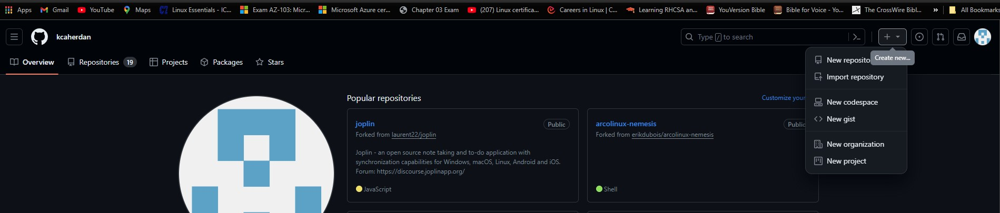
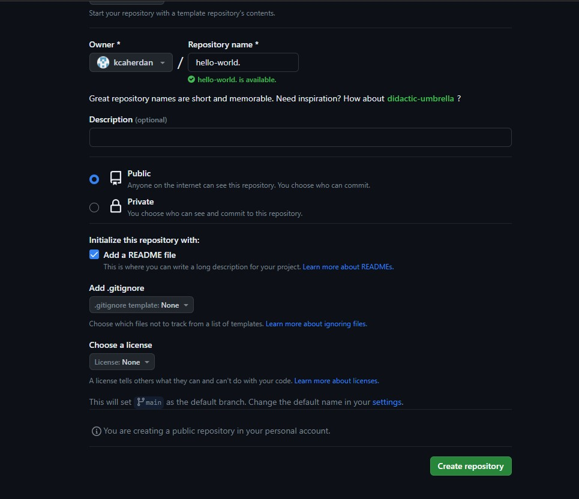
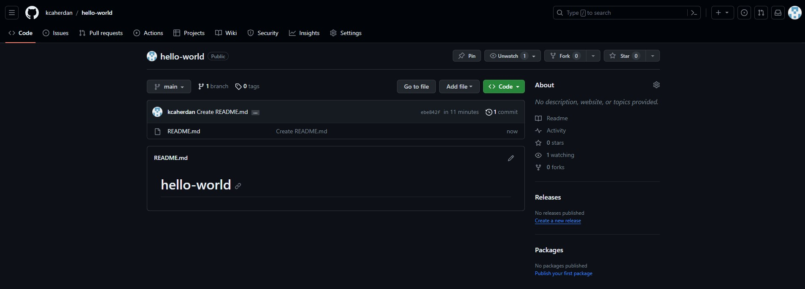
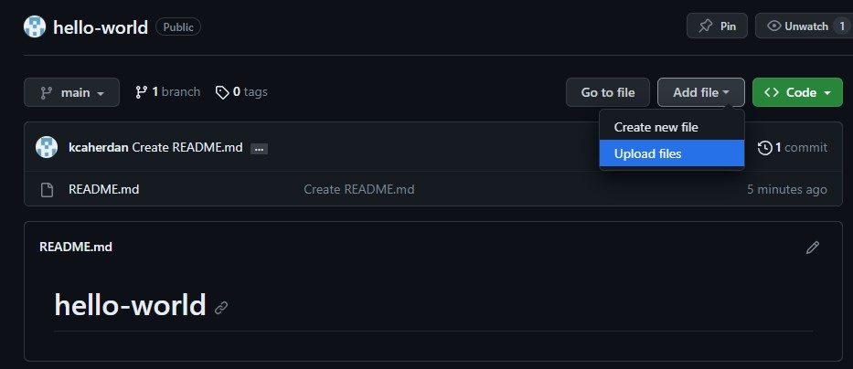

# maven-project

Simple Maven Project

Create a new github repository called "hello-world"

1. login to github
2. locate new repository and select

3. Input repository name as "hello-world"
4. Make repository "Public"
5. Add a README file and select "Create repository" 

6. New repository created!

7. Upload files from the devolopers

Drag additional files here.

8