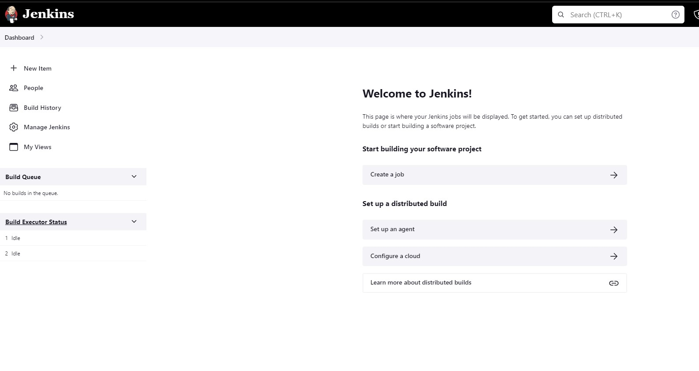

# maven-project

Simple Maven Project

Create a new github repository called "hello-world"

1. login to github
2. locate new repository and select

3. Input repository name as "hello-world"
4. Make repository "Public"
5. Add a README file and select "Create repository" 

6. New repository created!

7. Upload files from the devolopers

Drag additional files here.

8. setup Jenkins and login with your credentials

Since I am using a Jenkins container, I need to login as root and install java jdk 8 or 11,
also I need to install Maven, 
Java "apt install default-jdk"
java -version

Maven "apt install maven"
mvn -version

9. Install maven login; navitage to Manage jenkins :manage/pluginManager/available plugins
search for maven to install;

10. Create a Job on jemkins "A Maven Job"

11. Enter an item name "hello-world" and select ok

12 Configure Jenkins

 Git - Source Code Management

Build Root POM

Build the Project by pressing Build Now 

Building the project 

Finally, Build is successful

